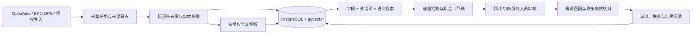

# 技术架构与数据方案

状态：2026-09-24 提案。版本是建议的主版本系列，启动编码时锁定最新安全补丁和依赖锁文件。

## 架构选择

| 层 | 首期选择 | 选择依据 / 实施约束 |
| --- | --- | --- |
| 后端和业务管理 | Python 3.12、Django 5.2 LTS、Django REST Framework | Django 自带用户、权限、后台与数据迁移，适合审核/派单类业务；DRF 对 5.2 有官方兼容说明。 |
| 前端 | React + TypeScript + Vite | 内部检索台、机会卡和审核队列需要可交互界面；API 与前端分离。先做桌面浏览器。 |
| 主数据库与检索 | PostgreSQL 17 + pgvector；结构化过滤、关键词与向量联合召回 | DOI/专利/机构/服务状态与向量放在同一个可事务化的数据底座；中英文关键词召回在第 4 周基准测试，不达标再增设专用搜索引擎。 |
| 定时采集与异步处理 | Celery 5.6 + Redis；单实例 Beat 调度 | 对外接口限速、重试、PDF 解析和模型任务不能占用 Web 请求；任务幂等，失败可重放。 |
| 文件 | S3 兼容对象存储或机构已有文件存储 | 仅存有授权的全文/附件和导出物；数据库存索引、校验和、权限与来源。 |
| 文献解析 | GROBID 容器，按需启用 | 仅对允许处理的 PDF 解析正文、作者、机构及参考文献；保留原文页码/段落映射。 |
| 模型 | 可替换的中文/英文大模型与嵌入模型接口 | 第 2 周用真实样本比较质量、速度、价格与数据边界；首期外部 API 只接收获准发送的公开文本。 |
| 交付与运维 | Linux、Docker Compose 试点部署、HTTPS、备份、基础监控和日志 | 适合十名内部用户的首期容量；进入正式服务前评估高可用、单点登录与安全要求。 |

Django 5.2 为长期支持版本；[官方发布说明](https://docs.djangoproject.com/en/5.2/releases/5.2/)。[DRF 官方站](https://www.django-rest-framework.org/)列出 5.2 支持。[pgvector](https://github.com/pgvector/pgvector)支持 PostgreSQL 内的向量检索。[Celery 稳定版文档](https://docs.celeryq.dev/en/stable/userguide/)包含周期任务与 Redis 使用说明。前端 TypeScript 见 [React 官方说明](https://react.dev/learn/typescript)。

## 数据流

### 采集与去重

- 每个来源一个适配器，配置服务条款、请求限速、游标、原始响应校验和、上游时间与本地获取时间。失败保留检查点并告警。
- 论文优先用 DOI 和来源 ID；专利用公开/申请号、国家/地区、种类码与专利族；作者用来源 ID/ORCID/机构和人工核验。标题相似只产生“可能重复”候选。
- 保留一对多来源映射；纠错、撤稿、专利状态变化形成事件，不覆盖历史记录。

### 检索、模型与证据

- 先按日期、机构、主题、国家/地区过滤，再结合关键词与向量排序；显示命中字段、版本、来源。中文分词/字段权重以标注集评估。
- 模型只做候选抽取与解释，输出固定字段、证据定位和“未知”。无对应来源段落的陈述不能自动进入已批准卡片。
- 记录模型版本、提示词版本、输入文档 ID、生成时间、人工修改。重新生成产生新版本，不覆盖已外发版本。
- 需求匹配分两步：先用明确约束排除，再按问题、方法、应用条件和团队能力排序。匹配分数不能代替领域专家判断。

## 最小数据表

`source_record`、`work`、`patent`、`person`、`organization`、`method_claim`、`evidence_span`、`watch_rule`、`demand`、`policy_program`、`opportunity`、`opportunity_version`、`review_action`、`service_case`、`audit_event`。记录外部稳定 ID、本地 UUID、创建/更新/有效时间；对可能同名实体保留候选关系与置信度。

`evidence_span` 至少含 `source_record_id`、原文位置或可复核链接、原文摘要、提取方法和人工核验标记。`opportunity_version` 指向引用的证据版本，确保事后能够重现外发依据。

## 安全和运行边界

1. 单机构租户；按角色和具体需求卡控制读取、编辑、审核、外发。对企业需求默认使用最小可见范围。
2. 外部 API 密钥保存在部署环境的秘密管理中，不写入仓库；出口请求记录服务、目的、数据类别与操作者。
3. 对象存储和数据库定期备份到独立位置，至少每周演练一次恢复流程；试点建议 RPO 24 小时、RTO 1 个工作日，正式服务另定。
4. 来源许可、论文全文处理权和专利数据再分发条件逐一记录。对外只发获准内容和原始链接，不把来源数据库原样转售。
5. 关键指标：采集延迟/错误率、源配额、去重冲突、索引延迟、检索耗时、模型花费、未审核外发次数。审核与权限事件进入不可随意修改的审计日志。

## 扩展条件

当数据规模、中文关键词召回或并发达到第 4/8 周压力测试门槛时，再比较 OpenSearch 等独立索引服务。新增专利数据源、全量快照、私有模型/GPU、跨机构租户、政策自动解析和知识图谱服务均作为后续阶段的明确决策，不占用首期关键路径。
